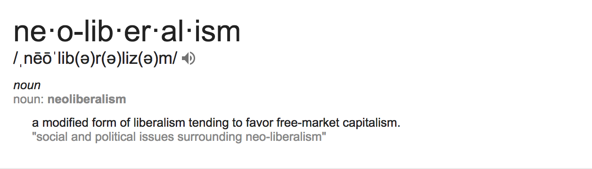

% "Workers of the world unite; you have nothing to lose but your chains." -Karl Marx
% Lydia Nguyen
% INLS161 SSII
<iframe width="100%" height="100%" src="https://www.youtube.com/embed/SVagGGIsqtI" frameborder="0" allowfullscreen></iframe>

## Welcome to my pessimistic, somewhat satirical presentation on neoliberalism and environmental destruction

# You may be wondering, what exactly is neoliberalism?

# Neoliberalism hurts

# What is our world coming to?

